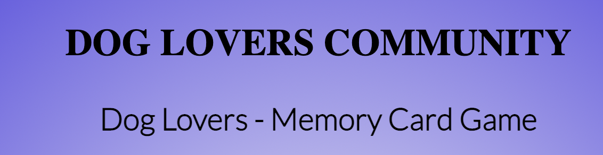
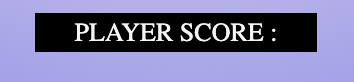
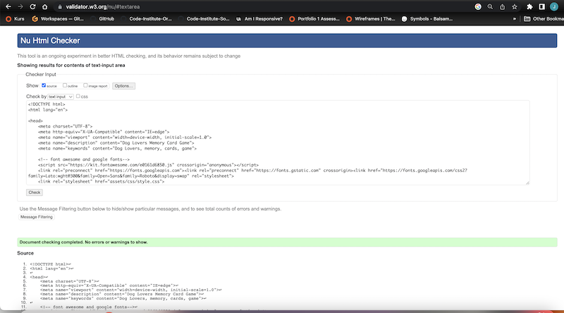

#  Dog Lovers Community  ReadMe  ReadMe

## Dog Lovers Community Memory Card Game
Dog Lovers Memory Card Game is designed for all ages. The goal of the game is to have found all the matching cards. Each move includes 2 cards being clicked on to find the according match to the first card. If you find all pairs You Win. How quick u can be?

## User Experience

The Dog Lovers Memory Card Game is create for pleasure and fun, a game for all ages.

### User Stories

* First-time visitors:
    * will be able to insert their username before the game starts.
    * should find out what the rules of the game are.
    * should be able to restart the game as many times as desired.
* Returning visitors:
    * should be able to restart the game as many times as desired.

## Design

* Colors and images has been picked from my first project portfolio i use same colors to make my projects similliar to each 

[Dog Lovers Community](https://jacekck.github.io/Dogs-Lovers-Community/);

* I have imported the follwoing fonts from Google Fonts:
   - Lato 
   - Roboto 
   - Open-Sans

* i have use font awesome kit; 

## Features

### General

The website is a one-page page containing:
* a prompt() when loading the page for the user to input their name
* the main heading on the top 
* the grid-board in the middle of the page
* in beetween grid-board and footer you have 
* the footer at the bottom

#### prompt()

.png)

When loading the page, user is required to insert a username to be able to play the game, which is then stored for later use. The user can also find a quick explanation what the goal of the game is.

#### Top of Page

At the top of the page you can find the h1 heading include page name and h2 heading include game name.

#### Player name and restart game button

In h3 heading i have add Player name and restart game button.

##### Game Board

In the middle of the page is the game-board located with all the 12 cards. The deck contains image of dog paw. Each time the game is restarted the deck will be shuffled randomly.
Once two cards are matched with each other, they will stay face open and aren't clickable anymore. If it wasn't a match, the cards will turn back around.

##### Alert()

%20if%20u%20match%20a%20cards.png)

%20if%20u%20dont%20find%20a%20match.png)

#### Player Score

When u match cards will be popup a number how many matches u have Up to 6 match.

#### Result 

If u match all the cards will be popup message in player score section.

#### Footer

The footer is located at the bottom of the page and contains the copyright icon.

# Testing 

[Am I Responsive](https://ui.dev/amiresponsive)

[jshint](https://jshint.com/)

[W3C_CSS_Validator](https://jigsaw.w3.org/css-validator/#validate_by_input)

[W3C_HTML_Validator](https://validator.w3.org/#validate_by_input)

### Languages Used

* HTML
* CSS
* JavaScript

## Programs & Libaries Used

* [FavIcon Generator](https://favicon.io/favicon-generator/) to generate the favicon used for my game page.
* [Am I Responsive](https://ui.dev/amiresponsive) was used to create a shot to see responsiveness on different devices.
* [Gitpod](https://www.gitpod.io/) for writing down the code and creating the website.
* [Github](https://github.com/) to save and store the progress and files used on the website.
* [Google Fonts](https://fonts.google.com/) to import the fonts used on the website.
* [W3C Validator](https://validator.w3.org/) to validate HTML.
* [W3C Jigsaw Validator](https://jigsaw.w3.org/css-validator/) to validate CSS.
* [Jshint](https://jshint.com/) to check my javascript file.
* [Font Awesome](https://fontawesome.com/) for the icons used on this website.

## Deployment

This project was created by using Gitpod. I used the pre-built template from [Code Institute](https://github.com/Code-Institute-Org/gitpod-full-template).
The following commands were used:
* **python3 -m http.server** - to run a local server to view the project.
* **git add .** - to add all the changes.
* **git commit -m "..."** - to commit all the changes to the local repository.
* **git push** - to push the committed changes to the Github repository.

## Acknowledgements

I have create this project by myself. To create this page i have use W3Cschool, stackoverlow.com, developer.mozilla.org  to undestand how function works as well i have watch a lot youtube videos to have some ideas how to make all this things works together.Slack-community to solve some bugs in my code. Thanks to my mentor for helping me thru this project.